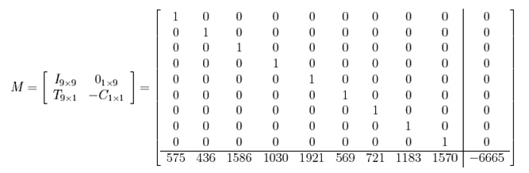

# Crypto Writeups
Hello! These are my writeups for the crypto section of the TAMU CTF. There were 5 great cryptography problems, and my team, Kernel Sanders, managed to solve all of them! I will be doing writeups for 4 of them, and I will link the writeup for "RSAaaay" for another member of my team. I did not work on these alone, so I would like to give a shout out to Josh and Blas for helping get this section done!

Before this CTF started, I had a few weeks to work on cryptography problems. I completed the first two sets of cryptopals, and I felt relatively experienced with AES and other block cipher problems. While there were no AES problems on this CTF, I had a lot of great practice in researching ECC and Knapsack cryptography. There were also lots of new problems to think logically about, so I had a great time with this CTF!

## -.-
This problem included a file called flag.txt, and this file included a bunch of "dah", "dit", and "di" phrases. This seemed to be morse code, and a few quick google searches verified that these were international morse code symbols. I used some python replace functions to turn this into a dot and dash representation.

```
ctxt = open("morse").read()

morse = ctxt.replace("-", "").replace("dah", "-").replace("dit", ".").replace("di", ".")
print morse
```

```
➜  tamu19 git:(master) ✗ python morse_sol.py
----- -..- ..... --... --... ----- ..--- .- -.... -.-. ..... ---.. --... ....- ....- --... ..... .---- ...-- ---.. -.... ..... ...-- ---.. --... .---- -.... . -.... -.. ....- -.. ..... ----. ..... ..... ..--- .- --... ...-- --... -.... ....- -.... ....- ---.. -.... -... -.... .- ....- ----. --... ....- ..--- .- ..... ..--- ..... .---- ..--- -.... ....- .- --... ----- ..... .- --... -.... -.... .- -.... -.. ..--- .---- ..--- ..... ..--- ..... ....- -... ....- ....- -.... -... -.... -.... --... ----- ..--- ...-- ..... . ....- . ...-- ----. -.... -.... -.... -... ...-- ....- -.... ....- ..... ..... ...-- ....- -.... -.-. ....- ..--- ...-- ...-- --... ..--- ..... ....- -.... ..-. ..... ....- ...-- ----- ..... ----- ..... .- ..... .---- -.... -.. ....- ...-- ..... .---- ....- ..... ....- -... ..... ----. ....- ..--- ...-- ....- ..... .- ....- -.. --... -.... ..--- .- ..--- .---- ....- -.... -.... -... ...-- ---.. -.... -.-. ..--- ..... -.... ..--- -.... .- --... .---- -.... -.-. ..... ----- ....- -.. -.... -.... ....- ----. ....- --... -.... -.. -.... .---- ..--- ..... ..--- ..... ....- -.... --... .- ....- --... ..--- ----- -.... --... -.... ----. -.... --... -.... ..... -.... -.. --... -... ....- ...-- ...-- .---- -.... ----. -.... ...-- ....- -... ..... ..-. -.... ...-- -.... -.-. ...-- .---- ....- ...-- ....- -... ..--- -.. --... ----. ...-- ----- --... ..... ..... ..-. -.... ---.. ...-- ....- --... -.... ...-- ...-- ..... ..-. -.... -.. ...-- ....- ....- ----. ...-- .---- --... -.. ..--- ----- --... ..... --... -.... ...-- ....- --... -.... --... .- ....- -... ..... .- --...
....- ...-- ....- --... ----. -.... ..-. -.... -.. -.... ----. ....- ....- ..... ...-- -.... ---.. ....- -.-. -.... -.. ...-- ---.. ..... .---- ....- ..... ....- -.... -.... . ..... ..... --... ....- --... --... ....- .- ....- ----- ....- . --... ..... ....- ..-. ..... ----. -.... -.... ..... ---.. ..--- -.... ...-- ---.. --... ..... ....- ----- ....- --... -.... . ..--- .---- ...-- .---- ..--- ..... ..... ....- --... .---- --... -.... ...-- ----- ..... -.... -.... ...-- ..... ..--- --... .- ..... -.... ..--- .---- -.... .- ..--- .---- --... -.... --... ..... --... ..... --... ----- ...-- ---.. ....- ..--- -.... .- -.... ....- ....- . ....- ----. --... .---- ....- ..... ...-- ..... --... --... ..--- ...-- ..--- ....- ..--- ..... ..... -.... ...-- ....- ..... ..... ..... .- ....- ..-. ..... ----. ..... .- ...-- ..--- --... .- ...-- --... ..... ....- ...-- ..--- ...-- ..... --... ....- ...-- --... ..--- -.... --... ---.. ....- -.-. ....- ----- ..... --... ....- ..-. ...-- --... ...-- ....- ...-- .---- ...-- ----- ..... .---- ....- ----.
```

Then, I found a site online (<https://morsecode.scphillips.com/translator.html>), which could be used to translate morse code. This gave me a large chunk of hex data. I used python to translate this hex data back into ascii:

```
>>> from Crypto.Util.number import long_to_bytes
>>> long_to_bytes(0X57702A6C58744751386538716E6D4D59552A737646486B6A49742A5251264A705A766A6D2125254B446B6670235E4E39666B346455346C423372546F5430505A516D4351454B5942345A4D762A21466B386C25626A716C504D6649476D612525467A4720676967656D7B433169634B5F636C31434B2D7930755F683476335F6D3449317D20757634767A4B5A7434796F6D694453684C6D385145466E5574774A404E754F59665826387540476E213125547176305663527A56216A217675757038426A644E49714535772324255634555A4F595A327A37543235743726784C40574F373431305149)
'Wp*lXtGQ8e8qnmMYU*svFHkjIt*RQ&JpZvjm!%%KDkfp#^N9fk4dU4lB3rToT0PZQmCQEKYB4ZMv*!Fk8l%bjqlPMfIGma%%FzG gigem{C1icK_cl1CK-y0u_h4v3_m4I1} uv4vzKZt4yomiDShLm8QEFnUtwJ@NuOYfX&8u@Gn!1%Tqv0VcRzV!j!vuup8BjdNIqE5w#$%V4UZOYZ2z7T25t7&xL@WO7410QI'
```

This included the flag, gigem{C1icK_cl1CK-y0u_h4v3_m4I1}. Recognizing morse code helped make this challenge much easier, but I enjoyed the use of classical ciphers!

## RSAaaay
This was a group effort, and I was overthinking this problem immensely. I will link Blas's writeup for this, but here is a quick overview:

* Factor n to get p and q
* Use p and q to get the totient, and use this totient and e to calculate d.
* Decrypt chunk by chunk, and split the decimal answers to get ascii values!

Here is Blas's Writeup: <https://github.com/bkojusner/WriteUps/blob/master/TAMU2019/RSAaaay.md>

## :)
For this challenge, all we are given is a large string of text: "XUBdTFdScw5XCVRGTglJXEpMSFpOQE5AVVxJBRpLT10aYBpIVwlbCVZATl1WTBpaTkBOQFVcSQdH". This appears to be base64 encoded, so my first step was to base64 decode it. Then, due to the fact that we are not given a key, my first ideas to check are xor ciphers and shift ciphers. Luckily, we may have a crib! We know that the flag starts with "gigem{", so if xoring the ciphertext by this gives some sort of keystream we may have all that we need!

```
➜  tamu19 git:(master) python
Python 2.7.12 (default, Dec  4 2017, 14:50:18)
[GCC 5.4.0 20160609] on linux2
Type "help", "copyright", "credits" or "license" for more information.
>>> import base64
>>> s = base64.b64decode("XUBdTFdScw5XCVRGTglJXEpMSFpOQE5AVVxJBRpLT10aYBpIVwlbCVZATl1WTBpaTkBOQFVcSQdH")
>>> chr(ord(s[0]) ^ ord("g"))
':'
>>> chr(ord(s[1]) ^ ord("i"))
')'
>>> chr(ord(s[2]) ^ ord("g"))
':'
>>> chr(ord(s[3]) ^ ord("e"))
')'
>>> chr(ord(s[4]) ^ ord("m"))
':'
>>> chr(ord(s[5]) ^ ord("{"))
')'
>>>
```

At this point, it seems like the plaintext is encrypted by a repeated-key xor cipher, and the key is ":)". Here is the python script that I used to solve this challenge:

```
import base64

ctxt = base64.b64decode("XUBdTFdScw5XCVRGTglJXEpMSFpOQE5AVVxJBRpLT10aYBpIVwlbCVZATl1WTBpaTkBOQFVcSQdH")

key = ":)"

flag = ""
for i in range(len(ctxt)):
    flag += chr(ord(ctxt[i]) ^ ord(key[i % 2]))

print flag
```

Running that script proved my hypothesis and gave the flag!

```
➜  tamu19 git:(master) ✗ python xor_sol.py
gigem{I'm not superstitious, but I am a little stitious.}
```

## Holey Knapsack

For this problem, we are given the ciphertext and public key:

* Ciphertext: 11b90d6311b90ff90ce610c4123b10c40ce60dfa123610610ce60d450d000ce61061106110c4098515340d4512361534098509270e5d09850e58123610c9
* Public Key: {99, 1235, 865, 990, 5, 1443, 895, 1477}

Here is where the CTF became significantly more difficult for me. I had never worked with the knapsack problem before, so I had to do some quick research in order to understand how the public key was derived from the private key. I used a few resources to understand this NP-hard problem and the cryptosystem that revolved around it, and here are some of the resources I used:

* <http://www.dtc.umn.edu/~odlyzko/doc/arch/knapsack.survey.pdf>
* <https://nrich.maths.org/2199>
* <http://www.math.ucsd.edu/~crypto/Projects/JenniferBakker/Math187/>
* <https://asecuritysite.com/encryption/knap>

After reading these, I felt like I had a decent idea on how the knapsack cryptosystem worked. The private key is a super-increasing set of weights. In this case, you can subtract weights from right to left in order to find the plaintext. However, the public key is created by doing modular multiplication on each weight. For example, an x and y could be chosen so that public\_1 = (x * private\_1) mod y. Then, the ciphertext is an addition of weights that corresponds to the 1's in the binary representation of each plaintext character. I will show how this works later.

Luckily, we can solve for the plaintext without using the private key, thanks to the Lenstra-Lenstra-Lovasz (LLL) Lattice reduction algorithm. This solves for the basis consisting of the shortest vectors in a matrix, and this shortest vector would consist of 1's and 0's, being the binary representation of the plaintext characters. Sage has an implementation of LLL(), so this will come in useful (I found out about this in another [CTF writeup](https://github.com/ctfs/write-ups-2014/tree/master/asis-ctf-quals-2014/archaic)).

Now, what I needed was the length of ciphertext that corresponded to one character of plaintext. I knew that the same plaintext would correspond to the same ciphertext, so I was able to search the ciphertext for duplicated substrings. I noticed that 11b9 repeated a few times, so I guessed that the ciphertext was 4 hex characters long. If this is true, then the length of the ciphertext should be divisible by 4. 

```
➜  tamu19 git:(master) ✗ python
Python 2.7.12 (default, Dec  4 2017, 14:50:18)
[GCC 5.4.0 20160609] on linux2
Type "help", "copyright", "credits" or "license" for more information.
>>> ctxt = "11b90d6311b90ff90ce610c4123b10c40ce60dfa123610610ce60d450d000ce61061106110c4098515340d4512361534098509270e5d09850e58123610c9"
>>> print len(ctxt)
124
>>> print len(ctxt) % 4
0
```

Awesome, this seems like a probable length of hex characters to correspond to a plaintext character, given the public key. Each group of four hex characters has a value less than each element of the public key added together, so this is possible. Now that we know the ciphertexts and the public key, we can apply the LLL reduction algorithm to get the plaintext bits! Here is how the matrix should be setup to apply the LLL (thanks to UCSD):


As can be seen, the identity matrix is used in the upper right corner, with the public key below and the negative ciphertext in the bottom left corner. Using Sage, I had to set this up with the public key on the right side instead of the bottom, and my solutions were across the rows rather than down the columns. However, the algorithm still worked! 

Here is the split ciphertext and the matrix that I generated with Sage's LLL(). Only one row had all 1's and 0's, and the only way that this could be a valid character would be reading it from right to left. The character that corresponds to 0b01100111 is 'g', which should be the first character of the flag!

```
➜  tamu19 git:(master) ✗ sage mat.py
['11b9', '0d63', '11b9', '0ff9', '0ce6', '10c4', '123b', '10c4', '0ce6', '0dfa', '1236', '1061', '0ce6', '0d45', '0d00', '0ce6', '1061', '1061', '10c4', '0985', '1534', '0d45', '1236', '1534', '0985', '0927', '0e5d', '0985', '0e58', '1236', '10c9']
[ 1  0  0 -1 -1  0  1  0 -1]
[ 1  1  1  0  0  1  1  0  0]
[ 0  0  1  0 -1 -1 -1  1 -1]
[ 1 -2  0  0  0  0  1  1  1]
[-1  1  0  1  1 -1  1  2  0]
[ 1 -1  0  0  1  1 -2  1 -1]
[ 0 -1  1  1 -1  1  1 -2 -1]
[-2 -1  0  0 -2  1  0  0  0]
[-2  0  2 -1  1 -1  1  0 -1]
```

After a few steps to debug my code (the value on the far right could be anything as long as the first 8 values in the row were 1 or 0). Here was the final code.

```
from sage.all import *

pub_key = "99, 1235, 865, 990, 5, 1443, 895, 1477".split(", ")

length = len(pub_key)

ctxt_str = "11b90d6311b90ff90ce610c4123b10c40ce60dfa123610610ce60d450d000ce61061106110c4098515340d4512361534098509270e5d09850e58123610c9"

ctxt_arr = [ctxt_str[i:i+4] for i in range(0, len(ctxt_str), 4)]
#print ctxt_arr

flag = ""

def short_vec(row):
    for val in row[:-1]:
        if val != 1 and val != 0:
            return False
    return True

for ctxt in ctxt_arr:
    ctxt = int(ctxt, 16)
    A = Matrix(ZZ, length+1, length+1)
    for i in xrange(length):
        A[i, i] = 1
    for i in xrange(length):
        A[i, length] = int(pub_key[i])
    A[length, length] = -ctxt
    res = A.LLL()
    #print res
    #raw_input()

    good_row = []
    for row in res:
        if short_vec(row):
            good_row = row
    if good_row != []:
        flag += chr(int(''.join([str(i) for i in good_row[:-1]])[::-1], 2))

print("Done!")
print flag
```

```
➜  tamu19 git:(master) ✗ sage mat.py
Done!
gigemmekle-hellman-knaack}
```

While there were small errors in the code, it was close enough to derive the flag from the answer: gigem{merkle_hellman-knapsack}. This was an interesting public key cryptosystem that I had never looked into before, and a great opportunity to learn about matrices in Sage!

## Mike's Marvelous Mystery curve
This was an interesting cryptography challenge because it began with only a pcap. Before doing any cryptography work, I had to get some sort of information out of the pcaps, which is new to me!

First, I opened the pcap in wireshark and started following tcp streams. The first and second streams were transfers of certificates, and the third stream contained a large amount of encrypted data:


I knew that I could use openssl to get the important information out of the certificate, but I don't use openssl often and there were a few too many flags for me to bother. Instead, I base64 decoded the chunk of text inside of the certificate, and this gave me a lot of information:

```
Certificate:
    Data:
        Version: 3 (0x2)
        Serial Number:
            b9:59:da:c4:d7:3f:bc:31
    Signature Algorithm: base64
        Issuer: C = US, ST = Texas, L = College Station, O = Texas A&M University, OU = tamuCTF, CN = Alice, emailAddress = alice@tamuctf.edu
        Validity
            Not Before: Oct  9 13:08:12 2018 GMT
            Not After : Nov  8 13:08:12 2018 GMT
        Subject: C = US, ST = Texas, L = College Station, O = Texas A&M University, OU = tamuCTF, CN = Alice, emailAddress = alice@tamuctf.edu
        Subject Public Key Info:
            Public Key Algorithm: id-ecPublicKey
                Public-Key:
                    61801292647
                    228288385004
                ASN1 OID: badPrime96v4
                CURVE: JustNo
                    Field Type: prime-field
                    Prime:
                        412220184797
                    A:
                        10717230661382162362098424417014722231813
                    B:
                        22043581253918959176184702399480186312
                    Generator:
                        56797798272
                        349018778637
        X509v3 extensions:
            X509v3 Subject Key Identifier:
                F0:4E:BF:87:92:16:9B:D6:53:DA:CC:6D:AB:22:0E:40:25:41:C5:CC
            X509v3 Authority Key Identifier:
                keyid:F0:4E:BF:87:92:16:9B:D6:53:DA:CC:6D:AB:22:0E:40:25:41:C5:CC

            X509v3 Basic Constraints: critical
                CA:TRUE
    Signature Algorithm: ecdsa-with-SHA256
         30:46:02:21:00:cc:3c:84:eb:19:73:e1:62:7f:81:78:99:c6:
         26:b8:86:9e:61:7e:82:87:f1:85:5c:75:e1:2d:60:37:55:b6:
         09:02:21:00:85:33:af:dc:34:0f:e5:13:8e:26:88:06:a3:13:
         d1:a2:ed:d5:04:cb:9c:50:d1:c4:a4:4d:42:92:bd:69:56:1a
```

This was Alice's key, and the second key held information for Bob. A few pieces of information stood out as important for this elliptic curve system. A and B were values for the equation of the elliptic curve: y^2 = x^3 + ax + b (sorry I need to learn more LaTex). The generator point's x and y coordinates are also given, and the prime is given for the field that contains the curve. Additionally, we have the public points for both Alice and Bob.

Before continuing, I will briefly explain how elliptic curve cryptography works and why it is seen as secure. Each party involved creates their public point by multiplying the generator point by a specific value k. If the generator is G and Alice's public key is A, then A = kG. In this case, k functions as a private key. When the two parties exchange keys, Bob multiplies Alice's public point A by his private key, and Alice multiplies Bob's public point by her private key. Because both private keys were multiplied by the generator point, this creates a shared key. The strength comes from the fact that it is computationally complex to derive the k from A and G, because this discrete logarithm on an elliptic curve is not as simple as dividing a few numbers. 

My team started looking into vulnerabilities relating to elliptic curve diffie-hellman and other forms of elliptic curve cryptography. We were looking into Pholig-Hellman, but this path wasn't leading anywhere quickly.

That night, I decided to try to compute the discrete logarithm of the points before doing more research. I used [this writeup](http://mslc.ctf.su/wp/hack-lu-ctf-2011-wipe-out-the-klingons-400/) as inspiration and help in writing Sage code, and here was the code that I used for the points in the certificates. 

```
from sage.all import *

p = 412220184797
A = 10717230661382162362098424417014722231813
B = 22043581253918959176184702399480186312

E = EllipticCurve(GF(p), [A, B])
G = E(56797798272, 349018778637)
Alice_Pub = E(61801292647, 228288385004)

Alice_Priv = G.discrete_log(Alice_Pub)
print("Alice Private key: " + str(Alice_Priv))

Bob_Pub = E(196393473219, 35161195210)
Bob_Priv = G.discrete_log(Bob_Pub)
print("Bob Private key: " + str(Bob_Priv))

share_1 = Alice_Pub * Bob_Priv
share_2 = Bob_Pub * Alice_Priv

print("Shared key (1): " + str(share_1))
print("Shared key (2): " + str(share_2))
```

Running this code gave me the following in well under 5 seconds:

```
➜  tamu19 git:(master) ✗ sage ecc_sol.py
Alice Private key: 54628069049
Bob Private key: 6895697291
Shared key (1): (130222573707 : 242246159397 : 1)
Shared key (2): (130222573707 : 242246159397 : 1)
```

Awesome! The two shared keys match, proving that this was the valid shared key! Also, the two keys concatenated had a length of 24 bytes, which is the key size for AES-192! We do not know the IV, but this shouldn't matter for anything beyond the first block.

I added the following python code to my script and ran it. The output was immense, so I piped it to less to find my flag. 

```
x = share_1[0]
y = share_1[1]

data = open("enc_data", "rb").read()
print data

shared_key = str(x) + str(y)
print shared_key
cipher = AES.new(shared_key, AES.MODE_CBC, IV="\x00"*16)
ptxt = cipher.decrypt(data)

print ptxt
```

The flag was inside of a large amount of the Hitchhiker's Guide (a great book). I found it as "gigem{Forty-two\_said\_Deep\_Thought}". This was my first ECC challenge, and I am glad that I was able to solve it during the CTF. I would like to thank TAMU for putting on a great CTF and giving enough time to solve difficult challenges in many categories!